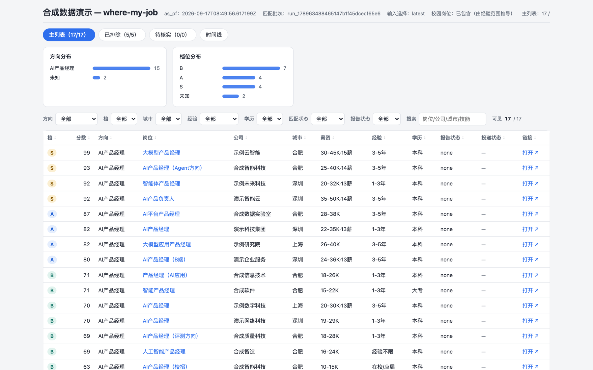
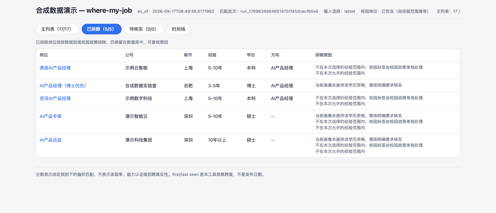
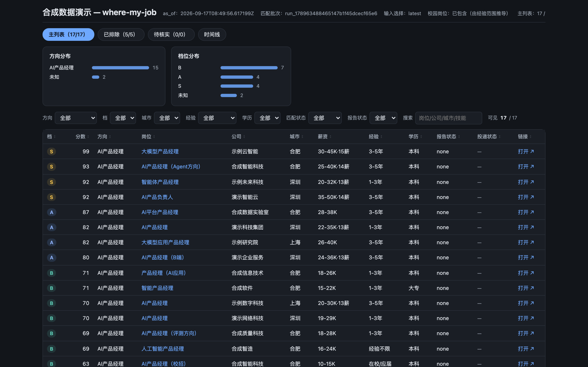
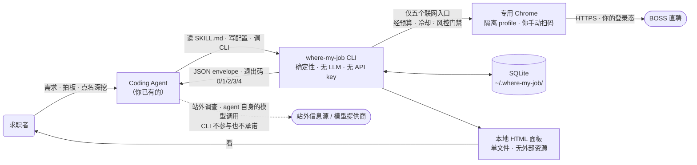
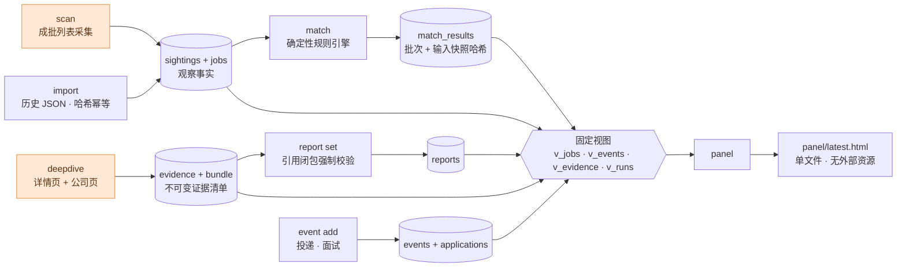
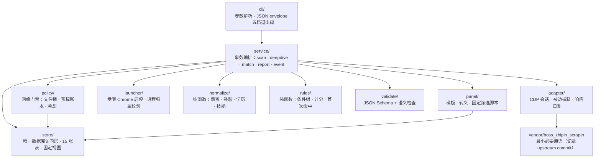
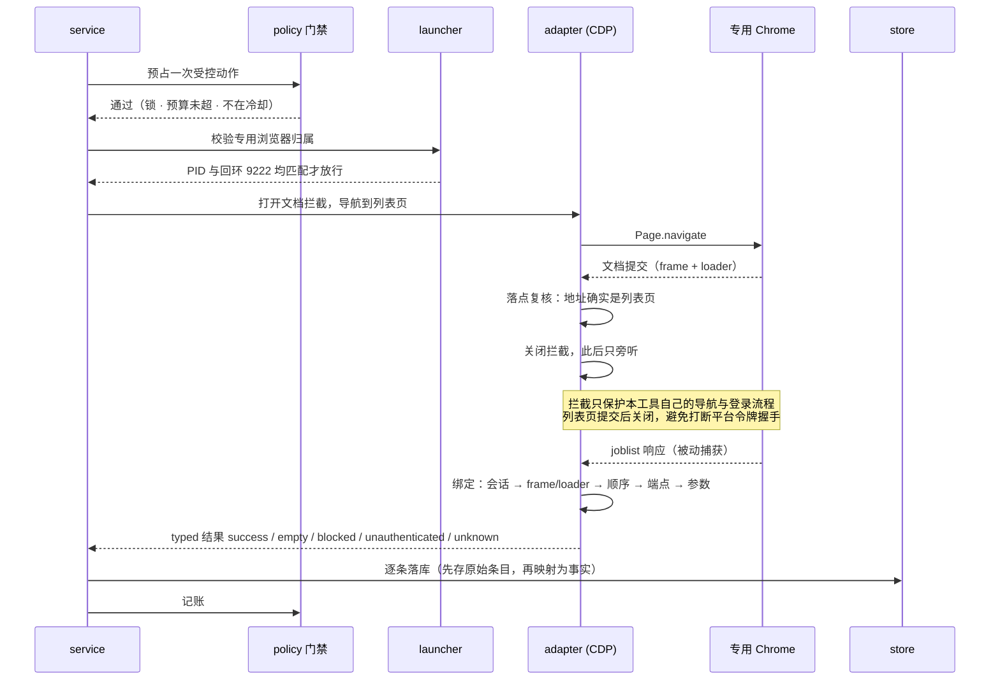

# where-my-job

**批量采集 BOSS 直聘的在招岗位，按你的硬性条件打分排序，直接定位最适合你的那几个。**
全程本地运行，由你已有的 coding agent 驱动——你不需要敲命令。



<sub>合成演示数据，公司与岗位均为虚构。这是 `where-my-job panel` 的真实产物：自包含 HTML，双击即开，不联网。</sub>

---

## 项目说明

### 解决什么

- **批量采集**你搜索范围内的在招岗位，按你的硬性条件打分排序，直接定位最适合的那几个。
- **多条件筛选**（学历 · 城市 · 岗位 · 经验）→ **规则排序**（结合你的个人档案打分，每一分都给理由）→ **判断养鱼岗**（长期挂岗的公司，投了也只是进人才池）。

<details>
<summary>面板的其它视图 · 这是什么 · 不做什么</summary>

每条排除都带理由，便于复核规则是否误杀：





### 这是什么

- Python CLI `where-my-job` + 一份 `SKILL.md`（告诉 agent 按什么顺序调用、什么不能做）。
- **CLI 不调用任何模型**，不管理 API key。排序是确定性规则引擎，同样输入永远同样结果。
- 分数 = "在你给的规则下的偏好匹配"，不是录取率，也不是招聘真实性。
- 招聘信号只给三种定性倾向（倾向真实在招 / 倾向长期挂岗 / 证据不足），标"推断"，不给概率。

### 不做什么

自动投递、自动打招呼、替你与招聘方互动、多用户数据汇聚、数据转售、规避平台访问控制、内建 LLM、服务端。

</details>

### 法律与隐私 —— 请先读这一节

- **BOSS 直聘平台条款：未核验。** 在线采集因此**出厂关闭**，需自行评估后开启。
- 供个人求职研究，不商用、不转售。个人使用、工具发行、数据公开、第三方模型处理要分开看——本地开源不自动等于合法。
- 法条：[《反不正当竞争法》第 13 条](https://ipc.court.gov.cn/zh-cn/news/view-4440.html)、[《个人信息保护法》第 72 条](https://www.cac.gov.cn/2021-08/20/c_1631050028355286.htm)。
- 凭证只在专用 Chrome profile，CLI 不读主浏览器 Cookie，数据只在本机、只有手动清理。
- 扫码时二维码以字符画出现在 agent 的命令输出里，会经过 agent 的运行环境与模型提供商。不接受可改为在专用 Chrome 手动登录。详见 `skill/references/privacy-boundary.md`。

---

## 上手：安装与使用

### 用 agent 开始（推荐）

复制下面这段进你的 agent（Claude Code / Codex / opencode / Kimi Code …），然后正常说话：

```text
请帮我安装并使用 where-my-job（本地求职情报工具）：把 https://github.com/emptylower/where-my-job.git 克隆到 ~/where-my-job（已存在就直接用），读其中的 SKILL.md，按「场景：安装与自检」和「场景：首次使用」带我走。所有命令都由你运行，不要让我自己去终端执行命令；安装系统工具、联网和扫码登录前先问我。
```

首发实测 Claude Code，Kimi Code CLI 做过一次端到端试用，其余未实测。

### 安装

<details>
<summary>或者你可以手动构建（点击展开）</summary>

要求：macOS、Google Chrome（仅在线功能需要）、[uv](https://docs.astral.sh/uv/)。

```bash
git clone https://github.com/emptylower/where-my-job.git ~/where-my-job
uv tool install ~/where-my-job          # 装成用户级命令
uv tool update-shell                    # 若 shell 找不到命令，把 uv 的 bin 目录加进 PATH，然后重开终端
where-my-job version                    # 期望：stdout 一行 JSON，data.version 为 "0.1.0"
```

给 Claude Code 用：把仓库放到（或软链到）`~/.claude/skills/where-my-job`，或项目内 `.claude/skills/where-my-job`。
给 Kimi Code CLI 用：链接到 `~/.kimi-code/skills/where-my-job`（自动发现未实测）。

</details>

### 常用指令

命令都由 agent 运行，列在这里供你核对。表里省略了统一前缀 `where-my-job`——完整写法是 `where-my-job login start`、`where-my-job login status --wait 30` 这样。

| 指令 | 作用 |
| --- | --- |
| `login start` / `login status --wait 30` | 扫码登录，二维码画在命令输出里 |
| `scan --strategy F --dry-run` | 展开任务计划、算动作数，**不联网** |
| `scan --strategy F` | 按策略批量采集岗位 |
| `match` | 按你的规则打分排序，不合条件的进"已排除"并注明原因 |
| `panel --open` | 生成并打开本地 HTML 面板 |
| `job list --filter tier=A --sort score --desc` | 按档位、分数等固定字段查询 |
| `deepdive JOB_ID` | 采集详情页 + 公司页，生成不可变证据包 |
| `report set JOB_ID --file F` | 提交四部分报告，引用范围被强制校验 |
| `event add --file F` | 记投递、面试等事件，进时间线 |
| `status` | 数据量、预算、冷却、锁、报告状态 |
| `browser stop` | 关闭本工具启动的专用浏览器 |

四条边界：**联网入口只有** `scan`、`deepdive`、`init --probe`、`login start`、`login status`；**同时只跑一个采集命令**（有文件锁、24 小时滚动预算、冷却）；**退出码 3 = 触发风控，应当停手**；**永不自动投递**。

---

## 架构与实现

### 系统上下文

CLI 确定性、不含模型；与 agent 之间只有 JSON envelope 和退出码。



### 数据流

橙色的 `scan` 与 `deepdive` 是**唯二联网的两步**，都必须先过网络门禁。其余全部离线。



原始响应与私有画像**不进任何视图**，所以不可能出现在面板或证据包里——结构保证，不是约定。

### 代码模块

单向依赖：只有 `store` 碰数据库，只有 `policy` 决定能否发起网络动作，规则与归一化是纯函数。



### 受控采集的真实时序

经 12 次真实核验才收敛。**关键：文档拦截是开关，不是常开**——一直开着会打断平台带一次性令牌的登录握手，页面被跳成空白。



响应认领采用**五级绑定**，任何一级不符即丢弃并记明原因。平台已把搜索条件移出接口地址、只剩防缓存参数时，绑定退化为"文档 + 顺序"，此时会记一条 `bound:document_only`，把能力边界如实交代，而不是假装核对过。

### 设计取舍

| 取舍 | 理由 |
| --- | --- |
| CLI 不含 LLM，推理全在 agent 里 | 可测试、可复现；同样输入必然同样输出，出错能定位 |
| 规则引擎是纯函数 + 声明式 JSON | 你能看懂、能改、能解释为什么这条排在前面 |
| 证据包不可变，引用闭包强制校验 | 报告不能引用不存在的证据，杜绝编造 |
| 只接受页面给我们的信息 | 不直接请求平台 API，不伪造请求，不做任何规避检测的改动 |
| 原始响应与私有画像不进视图 | 泄露在结构上就不可能，而不是靠约定 |
| 在线适配器出厂关闭 | 平台条款未核验之前，默认不联网 |

### 开发

```bash
uv run --project ~/where-my-job where-my-job version
uv run pytest -q                        # 892 passed
```

设计文档：`docs/superpowers/specs/2026-09-14-where-my-job-design-v3.md`
